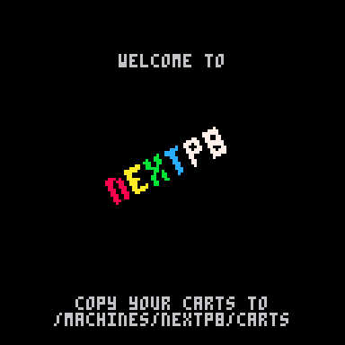
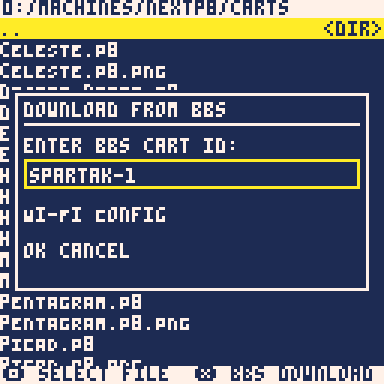

nextp8
======

nextp8 is a hobby project to make a Pico-8 compatible 'core' for the ZX Spectrum Next.

The Pico-8 is a fantasy 8-bit games console. The fantasy bit means that Pico-8 is a purely software implementation; there is no real Pico-8 hardware. Programs are written in Lua, a language not too aesthetically dissimilar from the Basic that ruled the 8-bit home computer heyday. Go buy a copy of Pico-8.

<table>
  <tr>
    <td></td>
    <td></td>
  </tr>
  <tr>
    <td></td>
    <td></td>
  </tr>
</table>


Getting Started
---------------

nextp8 is still work in progress and is targeted at the unreleased KS3 Next hardware, so there is no FPGA download yet!

You can, however, run the nextp8 firmware on a software model by following the instructions below.

Build instructions for Ubuntu 24.04:

* Install build dependencies:
```
sudo apt-get install build-essential cmake g++ gdb-multiarch libc6-dev libglu1-mesa-dev libsdl1.2-dev libsdl2-dev libsdl2-image-dev libssl-dev python3 python3-venv sed zip
```
* Checkout [nextp8-dev](https://github.com/atomice1/nextp8-dev):
```
git clone https://github.com/atomice1/nextp8-dev
cd nextp8-dev
```
* Checkout the other repositories:
```
git clone https://github.com/atomice1/femto8-nextp8
git clone https://github.com/atomice1/m68k-elf-gcc
git clone https://github.com/atomice1/nextp8
git clone https://github.com/atomice1/nextp8-bsp
git clone https://github.com/atomice1/nextp8-core
git clone https://github.com/atomice1/nextp8-loader
git clone https://github.com/atomice1/sQLux-nextp8
```
* Build the m68k-elf-gcc toolchain.
```
cd m68k-elf-gcc
./build-toolchain.sh --with-newlib
PATH=$PWD/m68k-toolchain/bin:$PATH
cd ..
```
* Copy the extra model files:
```
cp nextp8-core/c_models/* sQLux-nextp8/
cp femto8-nextp8/src/p8_audio.* sQLux-nextp8/
cp femto8-nextp8/src/p8_dsp.* sQLux-nextp8/
cp femto8-nextp8/src/queue.* sQLux-nextp8/
```
* Build the board support package (BSP):
```
cd nextp8-bsp
PATH=/opt/m68k-toolchain/bin:$PATH make
NEXTP8_BSP=$PWD
export NEXTP8_BSP
cd ..
```
* Build the boot loader:
```
cd nextp8-loader
make
cd ..
```
* Build femto8-nextp8:
```
cd femto8-nextp8
make PLATFORM=nextp8
cd ..
```
* Make a release tarball:
```
./scripts/make-release.sh nextp8.zip
```
* Make a Python virtual environment:
```
python3 -m venv venv
. venv/bin/activate
# Note: pyfatfs depends on pkg_resources which is removed in setuptools 82+.
python3 -m pip install --upgrade pip setuptools==81
python3 -m pip install -r scripts/requirements.txt
```
* Make an SD card image with the femto8-nextp8 binary on it:
```
python3 ./scripts/make-sdcard.py --output sQLux-nextp8/sdcard.img --release-zip nextp8.zip
```
* Build sQLux:
```
cd sQLux-nextp8
git submodule update --init --recursive
cmake -DCMAKE_EXPORT_COMPILE_COMMANDS=yes -DSUPPORT_SHADERS=yes -DNEXTP8_BSP=$PWD/../nextp8-bsp -B build
cmake --build build -j 8
```
* Create a link to the bootloader in the roms directory:
```
ln -s ${PWD}/../nextp8-loader/build/loader.bin roms/
```
* Start the model:
```
./build/sqlux
```

Hardware
--------

[nextp8-core](https://github.com/atomice1/nextp8-core)

### Introduction

The FPGA image implements the Pico-8 hardware... But that's not entirely true because the Pico-8 is a fantasy console so there is no real hardware! In fact Pico-8's fantasy hardware can't always be directly translated to real hardware. For example, the Pico-8's display is double buffered (that's why there is a FLIP function), but the memory map only exposes a single frame buffer. No problem! Just flip the frame buffer memory mapping in hardware. But that doesn't work because the Pico-8's frame buffer retains its contents after FLIP...  For this reason the FPGA image doesn't implement the Pico-8 fantasy hardware exactly because it doesn't always map well to real hardware.

### CPU

The nextp8 uses a m68k CPU with 32-bit registers and a 16-bit data bus. The Pico-8 does not have a native machine code, so it does not dictate a particular CPU architecture.

### Display Processor

The display processor uses a frame buffer layout corresponding exactly to the Pico-8 screen memory layout. It supports a 16 colour display palette drawn from a 32 colour hardware palette. The 128x128 Pico-8 screen is centered and zoomed 6x. The output resolution is 1024x768@60Hz.

The display processor supports native double buffering and the system contains VRAM for both the front and the back buffer

### Audio Processor

The audio processor implements the Pico-8 SFX and MUSIC. The note timing exactly matches the Pico-8, however the instrument waveforms, effects and filters are approximations. Custom instruments, including PCM instruments are supported.

The audio processor directly reads SFX data and MUSIC patterns from memory using DMA. It has priority over the CPU.

The SFX core also supports custom instruments where the custom instrument SFX core PCM output is input to the main SFX core.

### Peripherals

* SPI
* Keyboard
* Mouse
* Joysticks

### Memory Map

View the [memory map](memory_map.md).

nextp8 Software
---------------

### Firmware

[femto8-nextp8](https://github.com/atomice1/femto8-nextp8)

The nextp8 firmware is based on Ben Baker's femto8, ported to the nextp8 hardware. femto8 contains a Lua interpreter and the Pico-8 standard library routines. The display and audio are handled by the nextp8 hardware.

### Bootloader

[nextp8-loader](https://github.com/atomice1/nextp8-loader)

The nextp8 bootloader is loaded by the Next core loader before resetting into the nextp8 core. It functions as the nextp8 'ROM' and is responsible for loading the main firmware.

### Board Support Package (BSP)

[nextp8-bsp](https://github.com/atomice1/nextp8-bsp)

The BSP is based on newlib. It contains basic frame buffer support as well as drivers for the SD card in SPI mode, and the FAT32 filesystem.

### Toolchain

[m68k-elf-gcc](https://github.com/atomice1/m68k-elf-gcc)

The toolchain is based on GCC, binutils and newlib.

### Software Model

[sQLux-nextp8](https://github.com/atomice1/sQLux-nextp8/)

The nextp8 software model is designed to facilitate pre-silicon firmware development. It is based on the sQLux Sinclair QL emulator.

Licences
--------

### nextp8-core

Copyright (C) 2025 Chris January and other authors.<br>
Source Code: [https://github.com/atomice1/nextp8-core/](https://github.com/atomice1/nextp8-core/)<br>
Licensed under the [GNU General Public License 3.0 or later](licences/gpl-3.0.txt)

[nextp8-core licence notices](licences/nextp8-core_NOTICES.txt)

### femto8-nextp8

Copyright (C) 2025 Chris January<br>
Copyright 2023 Ben Baker

Permission is hereby granted, free of charge, to any person obtaining a copy of
this software and associated documentation files (the “Software”), to deal in
the Software without restriction, including without limitation the rights to
use, copy, modify, merge, publish, distribute, sublicense, and/or sell copies of
the Software, and to permit persons to whom the Software is furnished to do so,
subject to the following conditions:

The above copyright notice and this permission notice shall be included in all
copies or substantial portions of the Software.

THE SOFTWARE IS PROVIDED “AS IS”, WITHOUT WARRANTY OF ANY KIND, EXPRESS OR
IMPLIED, INCLUDING BUT NOT LIMITED TO THE WARRANTIES OF MERCHANTABILITY, FITNESS
FOR A PARTICULAR PURPOSE AND NONINFRINGEMENT. IN NO EVENT SHALL THE AUTHORS OR
COPYRIGHT HOLDERS BE LIABLE FOR ANY CLAIM, DAMAGES OR OTHER LIABILITY, WHETHER
IN AN ACTION OF CONTRACT, TORT OR OTHERWISE, ARISING FROM, OUT OF OR IN
CONNECTION WITH THE SOFTWARE OR THE USE OR OTHER DEALINGS IN THE SOFTWARE.

[femto8-nextp8 licence notices](licences/femto8-nextp8_NOTICES.txt)

### nextp8-bsp

Copyright (C) 2025 Chris January<br>
Portions copyright various authors

The authors hereby grant permission to use, copy, modify, distribute,
and license this software and its documentation for any purpose, provided
that existing copyright notices are retained in all copies and that this
notice is included verbatim in any distributions. No written agreement,
license, or royalty fee is required for any of the authorized uses.
Modifications to this software may be copyrighted by their authors
and need not follow the licensing terms described here, provided that
the new terms are clearly indicated on the first page of each file where
they apply.

Some components are licensed under the [Apache License 2.0](licences/apache-2.0.txt).

[nextp8-bsp licence notices](licences/nextp8-bsp_NOTICES.txt)

### nextp8-loader

Copyright (C) 2025 Chris January

Permission is hereby granted, free of charge, to any person obtaining a copy of
this software and associated documentation files (the "Software"), to deal in
the Software without restriction, including without limitation the rights to
use, copy, modify, merge, publish, distribute, sublicense, and/or sell copies of
the Software, and to permit persons to whom the Software is furnished to do so,
subject to the following conditions:

The above copyright notice and this permission notice shall be included in all
copies or substantial portions of the Software.

THE SOFTWARE IS PROVIDED "AS IS", WITHOUT WARRANTY OF ANY KIND, EXPRESS OR
IMPLIED, INCLUDING BUT NOT LIMITED TO THE WARRANTIES OF MERCHANTABILITY, FITNESS
FOR A PARTICULAR PURPOSE AND NONINFRINGEMENT. IN NO EVENT SHALL THE AUTHORS OR
COPYRIGHT HOLDERS BE LIABLE FOR ANY CLAIM, DAMAGES OR OTHER LIABILITY, WHETHER
IN AN ACTION OF CONTRACT, TORT OR OTHERWISE, ARISING FROM, OUT OF OR IN
CONNECTION WITH THE SOFTWARE OR THE USE OR OTHER DEALINGS IN THE SOFTWARE.
